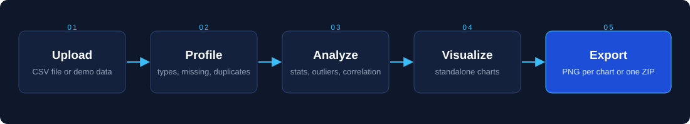

<div align="center">


<br>

[](https://autoinsight-gokulsanjay.streamlit.app/)
[](LICENSE)
[](https://www.python.org/)

[](https://streamlit.io/)
[](https://pandas.pydata.org/)
[](https://numpy.org/)
[](https://matplotlib.org/)
[](https://seaborn.pydata.org/)
[](https://plotly.com/python/)
[](CONTRIBUTING.md)

[**Live App**](https://autoinsight-gokulsanjay.streamlit.app/) &nbsp;·&nbsp; [**Features**](#features) &nbsp;·&nbsp; [**Quick Start**](#quick-start) &nbsp;·&nbsp; [**How It Works**](#how-it-works) &nbsp;·&nbsp; [**FAQ**](#faq) &nbsp;·&nbsp; [**Contribute**](#contributing)

</div>

<br>

## Overview

**AutoInsight** is a free, open-source automated data analyst built with Python and Streamlit. Upload a CSV file and it runs a complete **exploratory data analysis (EDA)**: dataset profiling, summary statistics, missing-value analysis, distributions, outlier detection, correlations, and relationships between columns.

Each result is a standalone chart. Download any chart as a PNG, or download all of them as a single ZIP organized into folders, ready for reports, slides and notebooks.

> The first hour of most data projects is the same: `df.describe()`, `df.isnull().sum()`, histograms, boxplots, a correlation heatmap. AutoInsight does that work for you so you can start with the actual questions.

**Try it now:** [autoinsight-gokulsanjay.streamlit.app](https://autoinsight-gokulsanjay.streamlit.app/). Click **Load Demo Dataset** for an instant example, or upload your own CSV.

<!--
  Add a screenshot or GIF here:
  <p align="center"></p>
-->

<br>

## Features

<table>
<tr>
<td width="50%" valign="top">

**▸ Dataset health check**<br>
Rows, columns, numeric and categorical counts, memory usage and duplicate rows at a glance.

**▸ Summary statistics**<br>
Count, mean, standard deviation, quartiles, min and max, plus skewness and kurtosis for every numeric column.

**▸ Missing-value analysis**<br>
Ranked bar chart of missing data per column. Shown only when values are actually missing.

**▸ Distributions**<br>
Histogram with KDE for each numeric column, with mean and median marked.

**▸ Outlier detection**<br>
Boxplots based on the 1.5 × IQR rule, with the outlier count in each chart title.

</td>
<td width="50%" valign="top">

**▸ Categorical frequencies**<br>
Top-category bar charts annotated with counts and percentages.

**▸ Correlation heatmap**<br>
Annotated Pearson correlation matrix across numeric features.

**▸ Relationship charts**<br>
Scatter plots with trendlines for the strongest numeric pairs, grouped boxplots for category vs numeric, and stacked percentage bars for category vs category.

**▸ One-click export**<br>
Single PNG per chart, or every chart in an organized ZIP at 150 DPI.

**▸ Local-friendly**<br>
No external APIs and no API keys. Run it on your own machine for fully private analysis.

</td>
</tr>
</table>

<br>

## How It Works

<p align="center">
  
</p>

1. **Load**: the CSV is read into a pandas DataFrame, with clear error messages for unreadable files.
2. **Profile**: each column is classified as numeric, categorical, boolean, datetime or high-cardinality text. Missing values, duplicates and cardinality are computed.
3. **Analyze**: univariate, bivariate and categorical analyses run automatically, with limits and sampling so large files stay responsive.
4. **Export**: charts are grouped into sections on the page, and a ZIP of every figure is built in memory.

### ZIP structure

```text
autoinsight_eda_<your_file>.zip
├── 00_summary/                           summary statistics, missing values
├── 01_univariate_numeric_distributions/
├── 02_outlier_boxplots/
├── 03_categorical_distributions/
├── 04_correlation_heatmap/
├── 05_numeric_relationships/
├── 06_cat_vs_numeric/
└── 07_cat_vs_cat/
```

### Limits for large datasets

| Chart type | Limit |
|:--|:--|
| Distributions and boxplots | Up to 50 numeric columns |
| Categorical bar charts | Top 15 categories per column |
| Correlation heatmap | Top 25 numeric columns by variance |
| Scatter plots | Top 50 correlated pairs, sampled to 1,500 rows |
| Categorical vs numeric | Up to 60 pairs, sampled to 2,500 rows |
| Categorical vs categorical | Up to 30 pairs, columns with 10 or fewer unique values |

<br>

## Tech Stack

| Layer | Tools |
|:--|:--|
| Interface | [Streamlit](https://streamlit.io/) |
| Data processing | [pandas](https://pandas.pydata.org/), [NumPy](https://numpy.org/) |
| Visualization | [Matplotlib](https://matplotlib.org/), [Seaborn](https://seaborn.pydata.org/), [Plotly](https://plotly.com/python/) |
| Hosting | [Streamlit Community Cloud](https://streamlit.io/cloud) |
| Language | Python 3.9+ |

<br>

## Quick Start

**Online:** open [autoinsight-gokulsanjay.streamlit.app](https://autoinsight-gokulsanjay.streamlit.app/) and upload a CSV.

**Locally:**

```bash
# 1. Clone
git clone https://github.com/gokulsanjayreddy/AutoInsight.git
cd AutoInsight

# 2. Create a virtual environment (recommended)
python -m venv .venv
source .venv/bin/activate        # Windows: .venv\Scripts\activate

# 3. Install dependencies
pip install -r requirements.txt

# 4. Run
streamlit run app.py
```

Open `http://localhost:8501`, upload a CSV or click **Load Demo Dataset**, and scroll through the report.

<br>

## Project Structure

```text
AutoInsight/
├── app.py                 Streamlit entry point: layout, caching, downloads
├── modules/
│   ├── __init__.py
│   ├── data_loader.py     CSV loading, type inference, profiling, demo dataset
│   └── eda.py             Chart generation and PNG / ZIP export helpers
├── assets/
│   ├── banner.svg         README banner
│   └── workflow.svg       README workflow diagram
├── requirements.txt
├── CONTRIBUTING.md
├── LICENSE
└── README.md
```

<br>

## Who It Is For

| | |
|:--|:--|
| **Students** | A fast first look at a dataset for coursework and Kaggle projects |
| **Analysts** | Shareable charts without writing plotting code |
| **ML engineers** | Feature inspection before modelling |
| **Researchers and business users** | Insight from a spreadsheet without learning Python |

<br>

## FAQ

<details>
<summary><b>Which file formats are supported?</b></summary>
<br>
CSV files (<code>.csv</code>). Export Excel sheets or database tables to CSV first.
</details>

<details>
<summary><b>Is my data sent to a third party?</b></summary>
<br>
The app makes no calls to external APIs and needs no keys. On the hosted app, your file is processed in your session on Streamlit Community Cloud. For sensitive data, run AutoInsight locally so nothing leaves your machine.
</details>

<details>
<summary><b>Does it handle large datasets?</b></summary>
<br>
Within reason. Chart counts are capped and scatter and grouped charts sample rows (see the limits table above) to keep the app responsive.
</details>

<details>
<summary><b>Can I use the charts in reports and presentations?</b></summary>
<br>
Yes. Each chart downloads as a 150 DPI PNG, or you can download everything as one ZIP.
</details>

<details>
<summary><b>How is it different from ydata-profiling or Sweetviz?</b></summary>
<br>
Those tools produce one HTML report. AutoInsight is an interactive app that gives you each chart as a separate image, grouped by analysis type, which makes it easy to place individual figures in slides and documents.
</details>

<br>

Have an idea? [Open an issue](https://github.com/gokulsanjayreddy/AutoInsight/issues).

<br>

## Contributing

Issues and pull requests are welcome. Please read [CONTRIBUTING.md](CONTRIBUTING.md) first.

```bash
git checkout -b feature/your-feature
git commit -m "Describe your change"
git push origin feature/your-feature
```

Then open a pull request.

<br>

## License

Released under the [MIT License](LICENSE).

<br>

<div align="center">

If AutoInsight saved you time, consider starring the repository.

[**Open AutoInsight**](https://autoinsight-gokulsanjay.streamlit.app/) &nbsp;·&nbsp; Built by [@gokulsanjayreddy](https://github.com/gokulsanjayreddy)

</div>

<details>
<summary>Keywords</summary>
<br>

automated EDA, exploratory data analysis, automatic data analysis, CSV analyzer, data profiling, data visualization, Streamlit app, Python data analysis tool, correlation heatmap, outlier detection, missing value analysis, descriptive statistics, no-code data analysis, pandas, matplotlib, seaborn, plotly, data science, open source.

</details>
